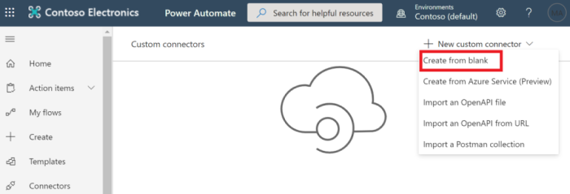
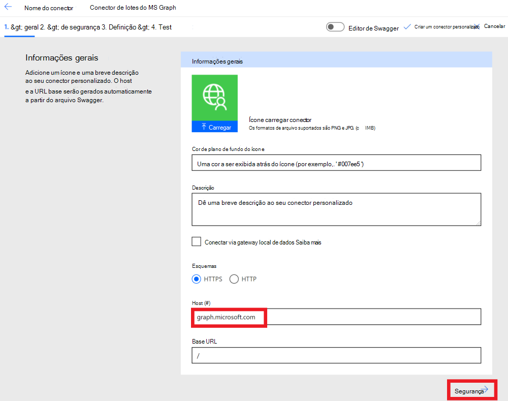
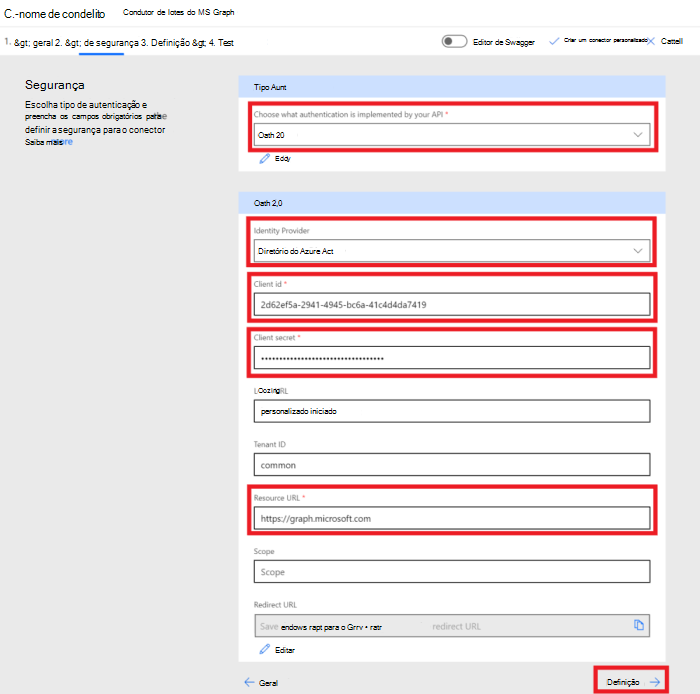

<!-- markdownlint-disable MD002 MD041 -->

Neste exercício, você criará um novo conector personalizado que pode ser usado no Microsoft Power Automate ou nos aplicativos de lógica do Azure.In this exercise, you will create a new custom connector which can be used in Microsoft Power Automate or in Azure Logic Apps. O arquivo de definição OpenAPI é criado com o caminho correto para o ponto de extremidade do Microsoft Graph `$batch` e configurações adicionais para habilitar a importação simples.The OpenAPI definition file is prebuilt with the correct path for the Microsoft Graph `$batch` endpoint and additional settings to enable simple import.

Há duas opções para criar um conector personalizado para o Microsoft Graph:There are two options to create a custom connector for Microsoft Graph:

- Criar de em brancoCreate from blank
- Importar um arquivo do OpenAPIImport an OpenAPI file

## Opção 1: criar um conector personalizado do modelo em brancoOption 1: Create custom connector from blank template

Abra um navegador e navegue até [Microsoft Power Automate](https://flow.microsoft.com).Open a browser and navigate to [Microsoft Power Automate](https://flow.microsoft.com). Entre com sua conta de administrador de locatário do Office 365.Sign in with your Office 365 tenant administrator account. Escolha **dados** no menu do lado esquerdo e selecione o item **conectores personalizados** no menu suspenso.Choose **Data** on the left-hand side menu, and select the **Custom Connectors** item in the drop-down menu.

Na página **conectores personalizados** , escolha o link **novo conector personalizado** no canto superior direito e, em seguida, selecione o item **criar em branco** no menu suspenso.On the **Custom Connectors** page choose the **New custom connector** link in the top right, then select the **Create from blank** item in the drop-down menu.

Insira `MS Graph Batch Connector` na caixa de texto **nome do conector** .Enter `MS Graph Batch Connector` in the **Connector name** text box. Choose **Continue**.Choose **Continue**.

Na página configuração do conector **geral** , preencha os campos da seguinte maneira.On the connector configuration **General** page, fill in the fields as follows.

- **Esquema**: https**Scheme**: HTTPS
- **Host**: `graph.microsoft.com`**Host**: `graph.microsoft.com`
- **URL base**: `/`**Base URL**: `/`

Escolha o botão de **segurança** para continuar.Choose **Security** button to continue.

Na página **segurança** , preencha os campos da seguinte maneira.On the **Security** page, fill in the fields as follows.

- **Escolha qual autenticação é implementada por sua API**: `OAuth 2.0`**Choose what authentication is implemented by your API**: `OAuth 2.0`
- **Provedor de identidade**: `Azure Active Directory`**Identity Provider**: `Azure Active Directory`
- **ID do cliente**: a ID do aplicativo que você criou no exercício anterior**Client id**: the application ID you created in the previous exercise
- **Segredo do cliente**: a chave que você criou no exercício anterior**Client secret**: the key you created in the previous exercise
- **URL de logon**: `https://login.windows.net`**Login url**: `https://login.windows.net`
- **ID do locatário**: `common`**Tenant ID**: `common`
- **URL do recurso**: `https://graph.microsoft.com` (sem à direita/)**Resource URL**: `https://graph.microsoft.com` (no trailing /)
- **Escopo**: deixar em branco**Scope**: Leave blank

Escolha o botão de **definição** para continuar.Choose **Definition** button to continue.

Na página **definição** , selecione **nova ação** e preencha os campos da seguinte maneira.On the **Definition** page, select **New Action** and fill in the fields as follows.

- **Resumo**: `Batch`**Summary**: `Batch`
- **Descrição**: `Execute Batch with Delegate Permission`**Description**: `Execute Batch with Delegate Permission`
- **ID da operação**: `Batch`**Operation ID**: `Batch`
- **Visibilidade**: `important`**Visibility**: `important`

Crie uma **solicitação** selecionando **importar de exemplo** e preencha os campos da seguinte maneira.Create **Request** by selecting **Import from Sample** and fill in the fields as follows.

- **Verbo**: `POST`**Verb**: `POST`
- **URL**: `https://graph.microsoft.com/v1.0/$batch`**URL**: `https://graph.microsoft.com/v1.0/$batch`
- **Cabeçalhos**: deixar em branco**Headers**: Leave blank
- **Corpo**: `{}`**Body**: `{}`

Selecione **Importar**.Select **Import**.

Escolha **criar conector** no canto superior direito.Choose **Create Connector** on the top-right. Após a criação do conector, copie a URL de **redirecionamento** gerado da página **segurança** .After the connector has been created, copy the generated **Redirect URL** from **Security** page.

Volte para o aplicativo registrado no [portal do Azure](https://aad.portal.azure.com) que você criou no exercício anterior.Go back to the registered application in the [Azure Portal](https://aad.portal.azure.com) you created in the previous exercise. Selecione **autenticação** no menu do lado esquerdo.Select **Authentication** on the left-hand side menu. Selecione **Adicionar uma plataforma**e, em seguida, selecione **Web**.Select **Add a platform**, then select **Web**. Insira a URL de redirecionamento copiada da etapa anterior nos **URIs de redirecionamento**e, em seguida, selecione **Configurar**.Enter the redirect URL copied from the previous step in the **Redirect URIs**, then select **Configure**.

## Opção 2: criar um conector personalizado importando o arquivo OpenAPIOption 2: Create custom connector by importing OpenAPI file

Usando um editor de texto, crie um novo arquivo vazio chamado `MSGraph-Delegate-Batch.swagger.json` e adicione o código a seguir.Using a text editor, create a new empty file named `MSGraph-Delegate-Batch.swagger.json` and add the following code.

[!code-json]

Abra um navegador e navegue até [Microsoft Power Automate](https://flow.microsoft.com).Open a browser and navigate to [Microsoft Power Automate](https://flow.microsoft.com). Entre com sua conta de administrador de locatário do Office 365.Sign in with your Office 365 tenant administrator account. Escolha **dados** no menu do lado esquerdo e selecione o item **conectores personalizados** no menu suspenso.Choose **Data** on the left-hand side menu, and select the **Custom Connectors** item in the drop-down menu.

Na página **conectores personalizados** , escolha o link **novo conector personalizado** no canto superior direito e, em seguida, selecione o item **importar um arquivo do openapi** no menu suspenso.On the **Custom Connectors** page choose the **New custom connector** link in the top right, then select the **Import an OpenAPI file** item in the drop-down menu.

Insira `MS Graph Batch Connector` na caixa de texto **nome do conector** .Enter `MS Graph Batch Connector` in the **Connector name** text box. Escolha o ícone de pasta para carregar o arquivo OpenAPI.Choose the folder icon to upload the OpenAPI file. Navegue até o `MSGraph-Delegate-Batch.swagger.json` arquivo que você criou.Browse to the `MSGraph-Delegate-Batch.swagger.json` file you created. Escolha **continuar** para carregar o arquivo openapi.Choose **Continue** to upload the OpenAPI file.

Na página configuração do conector, escolha o link **segurança** no menu de navegação.On the connector configuration page, choose the **Security** link in the navigation menu. Preencha os campos da seguinte maneira.Fill in the fields as follows.

- **Escolha qual autenticação é implementada por sua API**: `OAuth 2.0`**Choose what authentication is implemented by your API**: `OAuth 2.0`
- **Provedor de identidade**: `Azure Active Directory`**Identity Provider**: `Azure Active Directory`
- **ID do cliente**: a ID do aplicativo que você criou no exercício anterior**Client id**: the application ID you created in the previous exercise
- **Segredo do cliente**: a chave que você criou no exercício anterior**Client secret**: the key you created in the previous exercise
- **URL de logon**: `https://login.windows.net`**Login url**: `https://login.windows.net`
- **ID do locatário**: `common`**Tenant ID**: `common`
- **URL do recurso**: `https://graph.microsoft.com` (sem à direita/)**Resource URL**: `https://graph.microsoft.com` (no trailing /)
- **Escopo**: deixar em branco**Scope**: Leave blank

Escolha **criar conector** no canto superior direito.Choose **Create Connector** on the top-right. Após a criação do conector, copie a URL de **redirecionamento**gerada.After the connector has been created, copy the generated **Redirect URL**.

Volte para o aplicativo registrado no [portal do Azure](https://aad.portal.azure.com) que você criou no exercício anterior.Go back to the registered application in the [Azure Portal](https://aad.portal.azure.com) you created in the previous exercise. Selecione **autenticação** no menu do lado esquerdo.Select **Authentication** on the left-hand side menu. Selecione **Adicionar uma plataforma**e, em seguida, selecione **Web**.Select **Add a platform**, then select **Web**. Insira a URL de redirecionamento copiada da etapa anterior nos **URIs de redirecionamento**e, em seguida, selecione **Configurar**.Enter the redirect URL copied from the previous step in the **Redirect URIs**, then select **Configure**.

