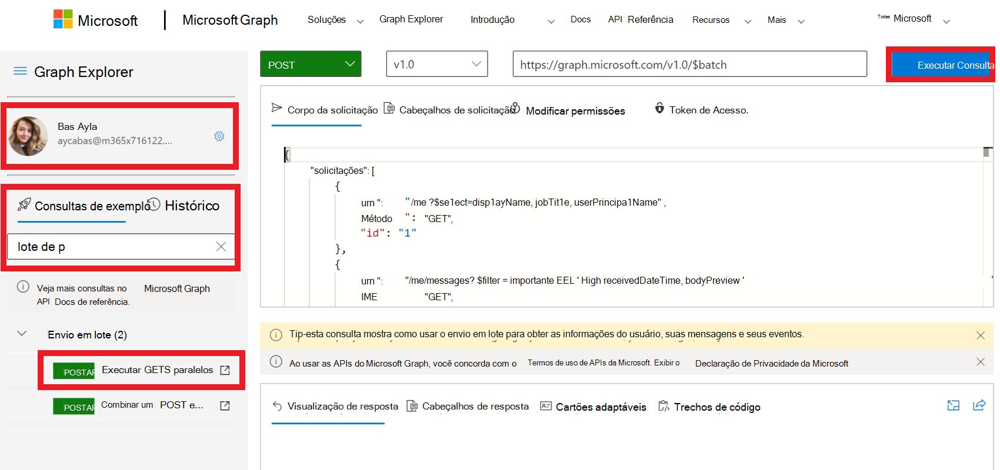
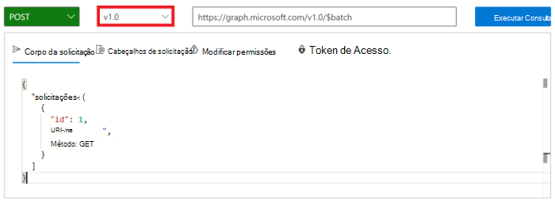
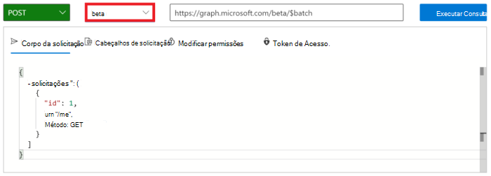

<!-- markdownlint-disable MD002 MD041 -->

Antes de criar um fluxo para consumir o novo conector, use o [Microsoft Graph Explorer](https://developer.microsoft.com/graph/graph-explorer) para descobrir alguns dos recursos e recursos de lotes JSON no Microsoft Graph.

Abra o [Microsoft Graph Explorer](https://developer.microsoft.com/graph/graph-explorer) no navegador. Entre com sua conta de administrador de locatário do Office 365. Procure por **lote** nas consultas de **amostra**.

Selecione a consulta **executar paralelo Obtém** exemplo no menu à esquerda. Escolha o botão **Executar consulta** no canto superior direito da tela.



A operação de lote de exemplo faz o lote de três solicitações HTTP GET e emite um único HTTP POST para o `/v1.0/$batch` ponto de extremidade do gráfico.

```json
{
    "requests": [
        {
            "url": "/me?$select=displayName,jobTitle,userPrincipalName",
            "method": "GET",
            "id": "1"
        },
        {
            "url": "/me/messages?$filter=importance eq 'high'&$select=from,subject,receivedDateTime,bodyPreview",
            "method": "GET",
            "id": "2"
        },
        {
            "url": "/me/events",
            "method": "GET",
            "id": "3"
        }
    ]
}
```

A resposta retornada é mostrada abaixo. Observe a matriz de respostas retornada pelo Microsoft Graph. As respostas para as solicitações em lote podem aparecer em uma ordem diferente da ordem das solicitações na POSTAgem. A `id` propriedade deve ser usada para correlacionar solicitações de lote individuais com respostas de lote específicas.

> [!NOTE]
> A resposta foi truncada para legibilidade.

```json
{
  "responses": [
    {
      "id": "1",
      "status": 200,
      "headers": {...},
      "body": {...}
    },
    {
      "id": "3",
      "status": 200,
      "headers": {...},
      "body": {...}
    }
    {
      "id": "2",
      "status": 200,
      "headers": {...},
      "body": {...}
    }
  ]
}
```

Cada resposta contém uma `id` propriedade,, `status` `headers` e `body` . Se a `status` propriedade de uma solicitação indicar uma falha, o `body` contém qualquer informação de erro retornada da solicitação.

Para garantir uma ordem de operações para as solicitações, as solicitações individuais podem ser sequenciadas usando a propriedade [dependn](https://docs.microsoft.com/graph/json-batching#sequencing-requests-with-the-dependson-property) .

Além de operações de sequenciamento e dependência, o processamento em lotes JSON assume um caminho base e executa as solicitações de um caminho relativo. Cada elemento de solicitação em lote é executado a partir dos `/v1.0/$batch` `/beta/$batch` pontos de extremidade, ou como especificado. Isso pode ter diferenças significativas, pois o `/beta` ponto de extremidade pode retornar saída adicional que pode não ser retornado no `/v1.0` ponto de extremidade.

Por exemplo, execute as duas consultas a seguir no [Explorador do Microsoft Graph](https://developer.microsoft.com/graph/graph-explorer).

1. Consulte o `/v1.0/$batch` ponto de extremidade usando a URL `/me` (solicitação de cópia e colagem abaixo).

```json
{
  "requests": [
    {
      "id": 1,
      "url": "/me",
      "method": "GET"
    }
  ]
}
```



Agora use o menu suspenso do seletor de versão para mudar para o `beta` ponto de extremidade e faça a mesma solicitação.



Quais são as diferenças nos resultados retornados? Tente algumas consultas para identificar algumas das diferenças.

Além do conteúdo de resposta diferente dos `/v1.0` pontos de `/beta` extremidade e de, é importante compreender os possíveis erros quando uma solicitação em lote é feita para o qual o consentimento de permissão não foi concedido. Por exemplo, a seguir está um item de solicitação em lote para criar um bloco de anotações do OneNote.

```json
{
  "id": 1,
  "url": "/groups/65c5ecf9-3311-449c-9904-29a2c76b9a50/onenote/notebooks",
  "headers": {
    "Content-Type": "application/json"
  },
  "method": "POST",
  "body": {
    "displayName": "Meeting Notes"
  }
}
```

No entanto, se as permissões para criar blocos de anotações do OneNote não tiverem sido concedidas, a seguinte resposta será recebida. Observe o código de status `403 (Forbidden)` e a mensagem de erro que indica que o token de OAuth fornecido não inclui os escopos necessários para concluir a ação solicitada.

```json
{
  "responses": [
    {
      "id": "1",
      "status": 403,
      "headers": {
        "Cache-Control": "no-cache"
      },
      "body": {
        "error": {
          "code": "40004",
          "message": "The OAuth token provided does not have the necessary scopes to complete the request.
            Please make sure you are including one or more of the following scopes: Notes.ReadWrite.All,
            Notes.Read.All (you provided these scopes: Group.Read.All,Group.ReadWrite.All,User.Read,User.Read.All)",
          "innerError": {
            "request-id": "92d50317-aa06-4bd7-b908-c85ee4eff0e9",
            "date": "2018-10-17T02:01:10"
          }
        }
      }
    }
  ]
}
```

Cada solicitação em seu lote retornará um código de status e resultados ou informações de erro. Você deve processar cada uma das respostas para determinar o sucesso ou a falha das operações de lote individuais.
