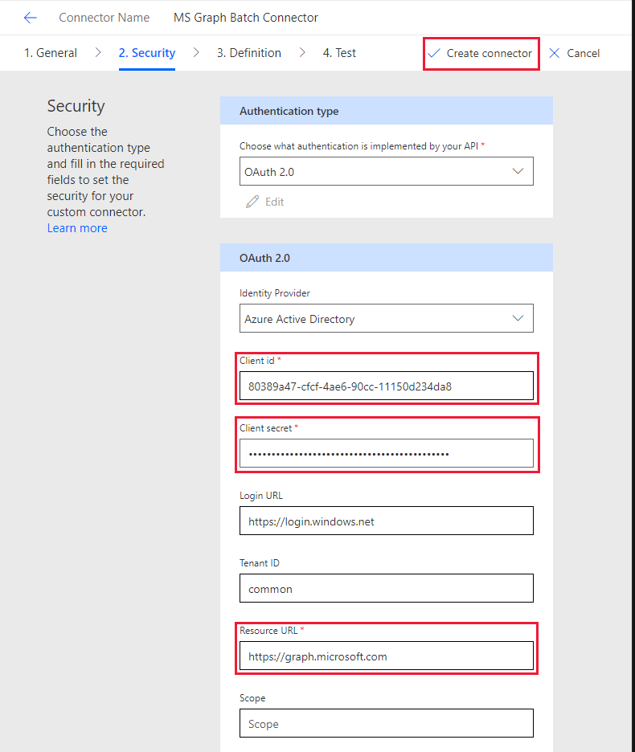

<!-- markdownlint-disable MD002 MD041 -->

Neste exercício, você criará um novo conector personalizado que pode ser usado no fluxo ou em aplicativos de lógica do Azure. O arquivo de definição de API aberto é pré-criado com o caminho correto para o ponto `$batch` de extremidade do Microsoft Graph e configurações adicionais para habilitar a importação simples.

Usando um editor de texto, crie um novo arquivo vazio `MSGraph-Delegate-Batch.swagger.json` chamado e adicione o código a seguir.

[!code-json]

Abra um navegador e navegue até [Microsoft Flow](https://flow.microsoft.com). Entre com sua conta de administrador de locatário do Office 365. No menu à esquerda, expanda **dados** e escolha **conectores personalizados**.

Na página **conectores personalizados** , escolha o link **novo conector personalizado** no canto superior direito e, em seguida, selecione o item **importar um arquivo do openapi** no menu suspenso. Insira `MS Graph Batch Connector` na caixa de texto **nome do conector** . Escolha o botão **importar** para carregar o arquivo de API aberto. Navegue até o `MSGraph-Delegate-Batch.swagger.json` arquivo que você criou. Escolha **continuar** para carregar o arquivo openapi.

 

Na página configuração do conector, escolha o link **segurança** no menu de navegação. Preencha os campos da seguinte maneira.

- **Escolha qual autenticação é implementada por sua API**:`OAuth 2.0`
- **Provedor de identidade**:`Azure Active Directory`
- **ID do cliente**: a ID do aplicativo que você criou no exercício anterior
- **Segredo do cliente**: a chave que você criou no exercício anterior
- **URL de logon**:`https://login.windows.net`
- **ID do locatário**:`common`
- **URL**do recurso `https://graph.microsoft.com` : (sem à direita/)
- **Escopo**: deixar em branco

Escolha **criar conector** no canto superior direito

Após a criação do conector, copie a URL de **redirecionamento**gerada.

Volte para o aplicativo registrado no [portal do Azure](https://aad.portal.azure.com) que você criou no exercício anterior. Selecione **visão geral** na folha do **aplicativo de lote do MS Graph** e, em seguida, selecione **Adicionar um URI de redirecionamento**. Adicione a **URL de redirecionamento** que você copiou no campo **URI de redirecionamento** e escolha **salvar**.

