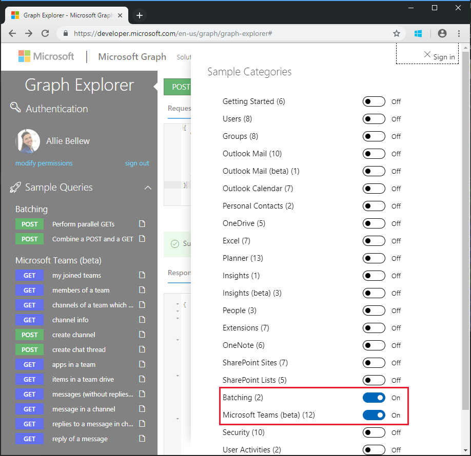
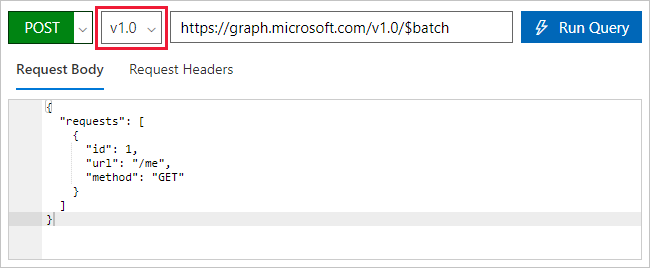
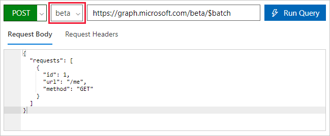

<!-- markdownlint-disable MD002 MD041 -->

<span data-ttu-id="6395c-101">Antes de criar um fluxo para consumir o novo conector, use o [Microsoft Graph Explorer](https://developer.microsoft.com/graph/graph-explorer) para descobrir alguns dos recursos e recursos de lotes JSON no Microsoft Graph.</span><span class="sxs-lookup"><span data-stu-id="6395c-101">Before creating a Flow to consume the new connector, use [Microsoft Graph Explorer](https://developer.microsoft.com/graph/graph-explorer) to discover some of the capabilities and features of JSON batching in Microsoft Graph.</span></span>

<span data-ttu-id="6395c-102">Abra o [Microsoft Graph Explorer](https://developer.microsoft.com/graph/graph-explorer) no navegador.</span><span class="sxs-lookup"><span data-stu-id="6395c-102">Open the [Microsoft Graph Explorer](https://developer.microsoft.com/graph/graph-explorer) in your browser.</span></span> <span data-ttu-id="6395c-103">Entre com sua conta de administrador de locatário do Office 365.</span><span class="sxs-lookup"><span data-stu-id="6395c-103">Sign in with your Office 365 tenant administrator account.</span></span> <span data-ttu-id="6395c-104">Escolha o link **Mostrar mais exemplos** no painel de navegação esquerdo e alterne os exemplos para o **envio em lotes** e para o **Microsoft Teams (beta)** . \*\*\*\*</span><span class="sxs-lookup"><span data-stu-id="6395c-104">Choose the **show more samples** link in the left navigation pane, and toggle the samples for **Batching** and **Microsoft Teams (beta)** to **On**.</span></span>



<span data-ttu-id="6395c-106">Selecione a consulta **executar paralelo Obtém** exemplo no menu à esquerda.</span><span class="sxs-lookup"><span data-stu-id="6395c-106">Select the **Perform parallel GETs** sample query in the left menu.</span></span> <span data-ttu-id="6395c-107">Escolha o botão **Executar consulta** no canto superior direito da tela.</span><span class="sxs-lookup"><span data-stu-id="6395c-107">Choose the **Run Query** button at the top right of the screen.</span></span>

<span data-ttu-id="6395c-108">A operação de lote de exemplo faz o lote de três solicitações HTTP GET e emite um único `/v1.0/$batch` http post para o ponto de extremidade do gráfico.</span><span class="sxs-lookup"><span data-stu-id="6395c-108">The sample batch operation batches three HTTP GET requests and issues a single HTTP POST to the `/v1.0/$batch` Graph endpoint.</span></span>

```json
{
  "requests": [
    {
      "url": "/me?$select=displayName,jobTitle,userPrincipalName",
      "method": "GET",
      "id": "1"
    },
    {
      "url": "/me/messages?$filter=importance eq 'high'&$select=from,subject,receivedDateTime,bodyPreview",
      "method": "GET",
      "id": "2"
    },
    {
      "url": "/me/events",
      "method": "GET",
      "id": "3"
    }
  ]
}
```

<span data-ttu-id="6395c-109">A resposta retornada é mostrada abaixo.</span><span class="sxs-lookup"><span data-stu-id="6395c-109">The response returned is shown below.</span></span> <span data-ttu-id="6395c-110">Observe a matriz de respostas retornada pelo Microsoft Graph.</span><span class="sxs-lookup"><span data-stu-id="6395c-110">Note the array of responses that is returned by Microsoft Graph.</span></span> <span data-ttu-id="6395c-111">As respostas para as solicitações em lote podem aparecer em uma ordem diferente da ordem das solicitações na POSTAgem.</span><span class="sxs-lookup"><span data-stu-id="6395c-111">The responses to the batched requests may appear in a different order than the order of the requests in the POST.</span></span> <span data-ttu-id="6395c-112">A `id` propriedade deve ser usada para correlacionar solicitações de lote individuais com respostas de lote específicas.</span><span class="sxs-lookup"><span data-stu-id="6395c-112">The `id` property should be used to correlate individual batch requests with specific batch responses.</span></span>

> [!NOTE]
> <span data-ttu-id="6395c-113">A resposta foi truncada para legibilidade.</span><span class="sxs-lookup"><span data-stu-id="6395c-113">The response has been truncated for readability.</span></span>

```json
{
  "responses": [
    {
      "id": "1",
      "status": 200,
      "headers": {...},
      "body": {...}
    },
    {
      "id": "3",
      "status": 200,
      "headers": {...},
      "body": {...}
    }
    {
      "id": "2",
      "status": 200,
      "headers": {...},
      "body": {...}
    }
  ]
}
```

<span data-ttu-id="6395c-114">Cada resposta contém uma `id`propriedade `status`, `headers`, e `body` .</span><span class="sxs-lookup"><span data-stu-id="6395c-114">Each response contains an `id`, `status`, `headers`, and `body` property.</span></span> <span data-ttu-id="6395c-115">Se a `status` propriedade de uma solicitação indicar uma falha, o `body` contém qualquer informação de erro retornada da solicitação.</span><span class="sxs-lookup"><span data-stu-id="6395c-115">If the `status` property for a request indicates a failure, the `body` contains any error information returned from the request.</span></span>

<span data-ttu-id="6395c-116">Para garantir uma ordem de operações para as solicitações, as solicitações individuais podem ser sequenciadas usando [](https://docs.microsoft.com/graph/json-batching#sequencing-requests-with-the-dependson-property) a propriedade dependn.</span><span class="sxs-lookup"><span data-stu-id="6395c-116">To ensure an order of operations for the requests, individual requests can be sequenced using the [dependsOn](https://docs.microsoft.com/graph/json-batching#sequencing-requests-with-the-dependson-property) property.</span></span>

<span data-ttu-id="6395c-117">Além de operações de sequenciamento e dependência, o processamento em lotes JSON assume um caminho base e executa as solicitações de um caminho relativo.</span><span class="sxs-lookup"><span data-stu-id="6395c-117">In addition to sequencing and dependency operations, JSON batching assumes a base path and executes the requests from a relative path.</span></span> <span data-ttu-id="6395c-118">Cada elemento de solicitação em lote é executado a `/v1.0/$batch` partir `/beta/$batch` dos pontos de extremidade, ou como especificado.</span><span class="sxs-lookup"><span data-stu-id="6395c-118">Each batch request element is executed from either the `/v1.0/$batch` OR `/beta/$batch` endpoints as specified.</span></span> <span data-ttu-id="6395c-119">Isso pode ter diferenças significativas, pois `/beta` o ponto de extremidade pode retornar saída adicional que pode não ser `/v1.0` retornado no ponto de extremidade.</span><span class="sxs-lookup"><span data-stu-id="6395c-119">This can have significant differences as the `/beta` endpoint may return additional output which may NOT be returned in the `/v1.0` endpoint.</span></span>

<span data-ttu-id="6395c-120">Por exemplo, execute as duas consultas a seguir no [Explorador do Microsoft Graph](https://developer.microsoft.com/graph/graph-explorer).</span><span class="sxs-lookup"><span data-stu-id="6395c-120">For example, execute the following two queries in the [Microsoft Graph Explorer](https://developer.microsoft.com/graph/graph-explorer).</span></span>

1. <span data-ttu-id="6395c-121">Consulte o `/v1.0/$batch` ponto de extremidade usando `/me` a URL (solicitação de cópia e colagem abaixo).</span><span class="sxs-lookup"><span data-stu-id="6395c-121">Query the `/v1.0/$batch` endpoint using the url `/me` (copy and paste request below).</span></span>

```json
{
  "requests": [
    {
      "id": 1,
      "url": "/me",
      "method": "GET"
    }
  ]
}
```



<span data-ttu-id="6395c-123">Agora use o menu suspenso do seletor de versão para mudar `beta` para o ponto de extremidade e faça a mesma solicitação.</span><span class="sxs-lookup"><span data-stu-id="6395c-123">Now use the version selector drop-down to change to the `beta` endpoint, and make the exact same request.</span></span>



<span data-ttu-id="6395c-125">Quais são as diferenças nos resultados retornados?</span><span class="sxs-lookup"><span data-stu-id="6395c-125">What are the differences in the results returned?</span></span> <span data-ttu-id="6395c-126">Tente algumas consultas para identificar algumas das diferenças.</span><span class="sxs-lookup"><span data-stu-id="6395c-126">Try some other queries to identify some of the differences.</span></span>

<span data-ttu-id="6395c-127">Além do conteúdo de resposta diferente dos pontos `/v1.0` de `/beta` extremidade e de, é importante compreender os possíveis erros quando uma solicitação em lote é feita para o qual o consentimento de permissão não foi concedido.</span><span class="sxs-lookup"><span data-stu-id="6395c-127">In addition to different response content from the `/v1.0` and `/beta` endpoints, it is important to understand the possible errors when a batch request is made for which permission consent has not been granted.</span></span> <span data-ttu-id="6395c-128">Por exemplo, a seguir está um item de solicitação em lote para criar um bloco de anotações do OneNote.</span><span class="sxs-lookup"><span data-stu-id="6395c-128">For example, the following is a batch request item to create a OneNote Notebook.</span></span>

```json
{
  "id": 1,
  "url": "/groups/65c5ecf9-3311-449c-9904-29a2c76b9a50/onenote/notebooks",
  "headers": {
    "Content-Type": "application/json"
  },
  "method": "POST",
  "body": {
    "displayName": "Meeting Notes"
  }
}
```

<span data-ttu-id="6395c-129">No enTanto, se as permissões para criar blocos de anotações do OneNote não tiverem sido concedidas, a seguinte resposta será recebida.</span><span class="sxs-lookup"><span data-stu-id="6395c-129">However, if the permissions to create OneNote Notebooks has not been granted, the following response is received.</span></span> <span data-ttu-id="6395c-130">Observe o código `403 (Forbidden)` de status e a mensagem de erro que indica que o token de OAuth fornecido não inclui os escopos necessários para concluir a ação solicitada.</span><span class="sxs-lookup"><span data-stu-id="6395c-130">Note the status code `403 (Forbidden)` and the error message which indicates the OAuth token provided does not include the scopes required to completed the requested action.</span></span>

```json
{
  "responses": [
    {
      "id": "1",
      "status": 403,
      "headers": {
        "Cache-Control": "no-cache"
      },
      "body": {
        "error": {
          "code": "40004",
          "message": "The OAuth token provided does not have the necessary scopes to complete the request.
            Please make sure you are including one or more of the following scopes: Notes.ReadWrite.All,
            Notes.Read.All (you provided these scopes: Group.Read.All,Group.ReadWrite.All,User.Read,User.Read.All)",
          "innerError": {
            "request-id": "92d50317-aa06-4bd7-b908-c85ee4eff0e9",
            "date": "2018-10-17T02:01:10"
          }
        }
      }
    }
  ]
}
```

<span data-ttu-id="6395c-131">Cada solicitação em seu lote retornará um código de status e resultados ou informações de erro.</span><span class="sxs-lookup"><span data-stu-id="6395c-131">Each request in your batch will return a status code and results or error information.</span></span> <span data-ttu-id="6395c-132">Você deve processar cada uma das respostas para determinar o sucesso ou a falha das operações de lote individuais.</span><span class="sxs-lookup"><span data-stu-id="6395c-132">You must process each of the responses in order to determine success or failure of the individual batch operations.</span></span>