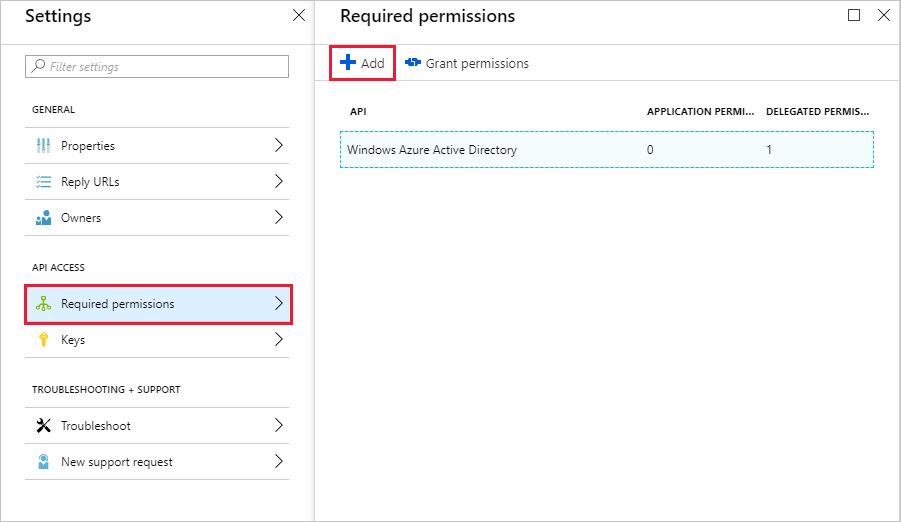

<!-- markdownlint-disable MD002 MD041 -->

Neste exercício, você criará um novo aplicativo do Azure Active Directory que será usado para fornecer as permissões delegadas para o conector personalizado.In this exercise, you will create a new Azure Active Directory Application which will be used to provide the delegated permissions for the custom connector.

Abra um navegador e navegue até o [centro de administração do Azure Active Directory](https://aad.portal.azure.com).Open a browser and navigate to [Azure Active Directory admin center](https://aad.portal.azure.com). Escolha o link do **Azure Active Directory** no menu de navegação à esquerda e, em seguida, escolha a entrada de **registros de aplicativos** na seção **gerenciar** da folha do **Azure Active Directory** .Choose the **Azure Active Directory** link in the left navigation menu, then choose the **App registrations** entry in the **Manage** section of the **Azure Active Directory** blade.

Escolha o item de menu **novo aplicativo de registro** na parte superior da folha **registros de aplicativos** .Choose the **New application registration** menu item at the top of the **App Registrations** blade.

Insira `MS Graph Batch App` no campo **nome** e `https://localhost.com/$batch` , no campo **URL de logon** e escolha **criar**.Enter `MS Graph Batch App` in the **Name** field, and `https://localhost.com/$batch` in the **Sign-on URL** field and choose **Create**.

Na página do **aplicativo de lote do MS Graph** , copie a **ID do aplicativo** do aplicativo.On the **MS Graph Batch App** page, copy the **Application ID** of the application. Você precisará disso no próximo exercício.You'll need this in the next exercise.

Escolha as **configurações** engrenagem sob o nome do aplicativo e, em seguida, escolha o item de menu **permissões necessárias** na folha configurações.Choose the **Settings** gear under the application name, then choose the **Required Permissions** menu item in the Settings blade. Escolha **Adicionar** na parte superior da folha **permissões necessárias** .Choose **Add** at the top of the **Required Permissions** blade.

Escolha a opção **selecionar uma API** na folha de **acesso Adicionar API** e selecione o item **Microsoft Graph** e escolha **selecionar** na parte inferior da folha.Choose the **Select an API** option in the **Add API access** blade, then select the **Microsoft Graph** item and choose **Select** at the bottom of the blade.

Na folha **habilitar acesso** , role para baixo até a seção **permissões delegadas** .On the **Enable Access** blade, scroll down to the **Delegated Permissions** section. Selecione a permissão delegada **ler e gravar todos os grupos** e, em seguida, escolha **selecionar** na parte inferior da folha.Select the **Read and write all groups** delegated permission, then choose **Select** at the bottom of the blade. Escolha **concluído** na parte inferior da folha **Adicionar acesso à API** .Choose **Done** at the bottom of the **Add API access** blade.

 

Escolha o item de menu **Keys** na folha **configurações** .Choose the **Keys** menu item on the **Settings** blade. Insira `forever` a **Descrição da chave** e selecione **nunca expira** no menu suspenso **duração** .Enter `forever` in the **Key description** and select **Never expires** from the **Duration** drop down menu. Escolha **salvar** na parte superior da folha de **chaves** .Choose **Save** at the top of the **Keys** blade. Copie o valor da chave para a nova chave.Copy the key value for the new key. Você precisará disso no próximo exercício.You'll need this in the next exercise.

> [!IMPORTANT]
> Esta etapa é crítica, pois a chave não estará acessível quando você fechar esta folha.This step is critical as the key will not be accessible once you close this blade. Salve essa chave em um editor de texto para usá-lo nos próximos exercícios.Save this key to a text editor for use in upcoming exercises.

Para habilitar o gerenciamento de serviços adicionais que podem ser acessados por meio do Microsoft Graph, incluindo as propriedades do Teams, você precisaria selecionar escopos adicionais e apropriados para habilitar o gerenciamento de serviços específicos.To enable management of additional services accessible via the Microsoft Graph, including Teams properties, you would need to select additional, appropriate scopes to enable managing specific services. Por exemplo, para estender nossa solução para habilitar a criação de blocos de anotações do OneNote ou planos do Planner, Buckets e tarefas, você precisaria adicionar os escopos de permissão necessários para as APIs relevantes.For example, to extend our solution to enable creating OneNote Notebooks or Planner plans, buckets and tasks you would need to add the required permission scopes for the relevant APIs.