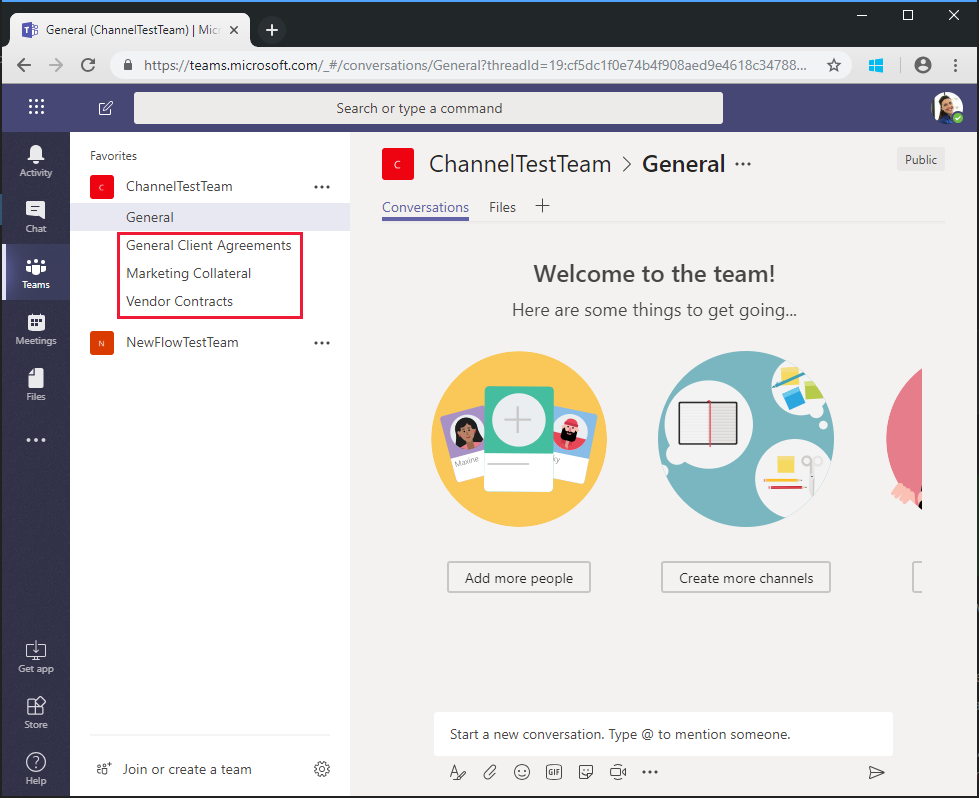

<!-- markdownlint-disable MD002 MD041 -->

<span data-ttu-id="342d0-101">O fluxo que você criou no exercício anterior usa a `$batch` API para fazer duas solicitações individuais para o Microsoft Graph.</span><span class="sxs-lookup"><span data-stu-id="342d0-101">The Flow you created in the previous exercise uses the `$batch` API to make two individual requests to the Microsoft Graph.</span></span> <span data-ttu-id="342d0-102">Chamar o `$batch` ponto de extremidade dessa forma oferece alguns benefícios e flexibilidade, mas a potência real `$batch` do ponto de extremidade é exibida ao executar várias solicitações ao Microsoft `$batch` Graph em uma única chamada.</span><span class="sxs-lookup"><span data-stu-id="342d0-102">Calling the `$batch` endpoint this way provides some benefit and flexibility, but the true power of the `$batch` endpoint comes when executing multiple requests to Microsoft Graph in a single `$batch` call.</span></span> <span data-ttu-id="342d0-103">Neste exercício, você estenderá o exemplo de criação de um grupo unificado e associando uma equipe para incluir a criação de vários canais padrão para a `$batch` equipe em uma única solicitação.</span><span class="sxs-lookup"><span data-stu-id="342d0-103">In this exercise, you will extend the example of creating a Unified Group and associating a Team to include creating multiple default Channels for the Team in a single `$batch` request.</span></span>

<span data-ttu-id="342d0-104">Abra o [Microsoft Flow](https://flow.microsoft.com) no seu navegador e entre com sua conta de administrador de locatário do Office 365.</span><span class="sxs-lookup"><span data-stu-id="342d0-104">Open [Microsoft Flow](https://flow.microsoft.com) in your browser and sign in with your Office 365 tenant administrator account.</span></span> <span data-ttu-id="342d0-105">Selecione o fluxo que você criou na etapa anterior e escolha **Editar**.</span><span class="sxs-lookup"><span data-stu-id="342d0-105">Select the Flow you created in the previous step and choose **Edit**.</span></span>

<span data-ttu-id="342d0-106">Escolha **nova etapa** e digite `Batch` na caixa de pesquisa.</span><span class="sxs-lookup"><span data-stu-id="342d0-106">Choose **New step** and type `Batch` in the search box.</span></span> <span data-ttu-id="342d0-107">Adicione a ação do **conector de lotes do MS Graph** .</span><span class="sxs-lookup"><span data-stu-id="342d0-107">Add the **MS Graph Batch Connector** action.</span></span> <span data-ttu-id="342d0-108">Escolha as reticências e renomeie `Batch POST-channels`esta ação como.</span><span class="sxs-lookup"><span data-stu-id="342d0-108">Choose the ellipsis and rename this action to `Batch POST-channels`.</span></span>

<span data-ttu-id="342d0-109">Adicione o seguinte código à caixa de texto **corpo** da ação.</span><span class="sxs-lookup"><span data-stu-id="342d0-109">Add the following code into the **body** text box of the action.</span></span>

```json
{
  "requests": [
    {
      "id": 1,
      "url": "/teams/REPLACE/channels",
      "headers": {
        "Content-Type": "application/json"
      },
      "method": "POST",
      "body": {
        "displayName": "Marketing Collateral",
        "description": "Marketing collateral and documentation."
      }
    },
    {
      "id": 2,
      "dependsOn": [
        "1"
      ],
      "url": "/teams/REPLACE/channels",
      "headers": {
        "Content-Type": "application/json"
      },
      "method": "POST",
      "body": {
        "displayName": "Vendor Contracts",
        "description": "Vendor documents, contracts, agreements and schedules."
      }
    },
    {
      "id": 3,
      "dependsOn": [
        "2"
      ],
      "url": "/teams/REPLACE/channels",
      "headers": {
        "Content-Type": "application/json"
      },
      "method": "POST",
      "body": {
        "displayName": "General Client Agreements",
        "description": "General Client documents and agreements."
      }
    }
  ]
}
```

<span data-ttu-id="342d0-110">Observe que as três solicitações acima estão usando [](https://docs.microsoft.com/graph/json-batching#sequencing-requests-with-the-dependson-property) a propriedade dependn para especificar uma ordem de sequência, e cada uma executará uma solicitação post para criar um novo canal na nova equipe.</span><span class="sxs-lookup"><span data-stu-id="342d0-110">Notice the three requests above are using the [dependsOn](https://docs.microsoft.com/graph/json-batching#sequencing-requests-with-the-dependson-property) property to specify a sequence order, and each will execute a POST request to create a new channel in the new Team.</span></span>

<span data-ttu-id="342d0-111">Selecione cada instância do `REPLACE` espaço reservado e, em seguida, selecione **expressão** no painel conteúdo dinâmico.</span><span class="sxs-lookup"><span data-stu-id="342d0-111">Select each instance of the `REPLACE` placeholder, then select **Expression** in the dynamic content pane.</span></span> <span data-ttu-id="342d0-112">Adicione a seguinte fórmula à **expressão**.</span><span class="sxs-lookup"><span data-stu-id="342d0-112">Add the following formula into the **Expression**.</span></span>

```js
body('Batch_PUT-team').responses[0].body.id
```


<span data-ttu-id="342d0-114">Escolha **salvar**e, em seguida, escolha **testar** para executar o fluxo.</span><span class="sxs-lookup"><span data-stu-id="342d0-114">Choose **Save**, then choose **Test** to execute the Flow.</span></span> <span data-ttu-id="342d0-115">Selecione o botão de opção **eu executarei a ação do gatilho** e, em seguida, escolha **salvar & Test**.</span><span class="sxs-lookup"><span data-stu-id="342d0-115">Select the **I'll perform the trigger** action radio button, then choose **Save & Test**.</span></span> <span data-ttu-id="342d0-116">Insira um nome de grupo exclusivo no campo **nome** sem espaços e escolha **executar fluxo** para executar o fluxo.</span><span class="sxs-lookup"><span data-stu-id="342d0-116">Enter a unique group name in the **Name** field without spaces, and choose **Run flow** to execute the Flow.</span></span>


<span data-ttu-id="342d0-118">Depois que o fluxo for iniciado, escolha o link **Exibir atividade de execução do fluxo** e, em seguida, escolha o fluxo de execução para ver o log de atividades.</span><span class="sxs-lookup"><span data-stu-id="342d0-118">Once the Flow starts, choose the **See flow run activity** link, then choose the running Flow to see the activity log.</span></span>

<span data-ttu-id="342d0-119">Quando o fluxo é concluído, a saída final da `Batch POST-channels` ação tem uma resposta de Status http 201 para cada canal criado.</span><span class="sxs-lookup"><span data-stu-id="342d0-119">When the Flow completes, the final output for the `Batch POST-channels` action has a 201 HTTP Status response for each Channel created.</span></span>


<span data-ttu-id="342d0-121">Navegue até [Microsoft Teams](https://teams.microsoft.com) e entre com sua conta de administrador de locatário do Office 365.</span><span class="sxs-lookup"><span data-stu-id="342d0-121">Browse to [Microsoft Teams](https://teams.microsoft.com) and sign in with your Office 365 tenant administrator account.</span></span> <span data-ttu-id="342d0-122">Verifique se a equipe que você acabou de criar aparece e inclui os três canais criados `$batch` pela solicitação.</span><span class="sxs-lookup"><span data-stu-id="342d0-122">Verify that the team you just created appears and includes the three channels created by the `$batch` request.</span></span>



<span data-ttu-id="342d0-124">Embora a ação `Batch POST-channels` acima tenha sido implementada neste tutorial como uma ação separada, as chamadas para criar os canais podem ter sido adicionadas como chamadas adicionais `Batch PUT-team` na ação.</span><span class="sxs-lookup"><span data-stu-id="342d0-124">While the above `Batch POST-channels` action was implemented in this tutorial as a separate action, the calls to create the channels could have been added as additional calls in the `Batch PUT-team` action.</span></span> <span data-ttu-id="342d0-125">Isso criaria a equipe e todos os canais em uma única chamada em lote.</span><span class="sxs-lookup"><span data-stu-id="342d0-125">This would have created the Team and all Channels in a single batch call.</span></span> <span data-ttu-id="342d0-126">Tente fazer isso por conta própria.</span><span class="sxs-lookup"><span data-stu-id="342d0-126">Give that a try on your own.</span></span>

<span data-ttu-id="342d0-127">Por fim, lembre-se de que as chamadas [em lote JSON](https://docs.microsoft.com/graph/json-batching) retornarão um código de status HTTP para cada solicitação.</span><span class="sxs-lookup"><span data-stu-id="342d0-127">Finally, remember that [JSON Batching](https://docs.microsoft.com/graph/json-batching) calls will return an HTTP status code for each request.</span></span> <span data-ttu-id="342d0-128">Em um processo de produção, talvez você queira combinar o pós-processamento dos resultados com uma [`Apply to each`](https://docs.microsoft.com/flow/apply-to-each) ação e validar cada resposta individual tem um código de status 201 ou compensar outros códigos de status recebidos.</span><span class="sxs-lookup"><span data-stu-id="342d0-128">In a production process, you may want to combine post processing of the results with an [`Apply to each`](https://docs.microsoft.com/flow/apply-to-each) action and validate each individual response has a 201 status code or compensate for any other status codes received.</span></span>